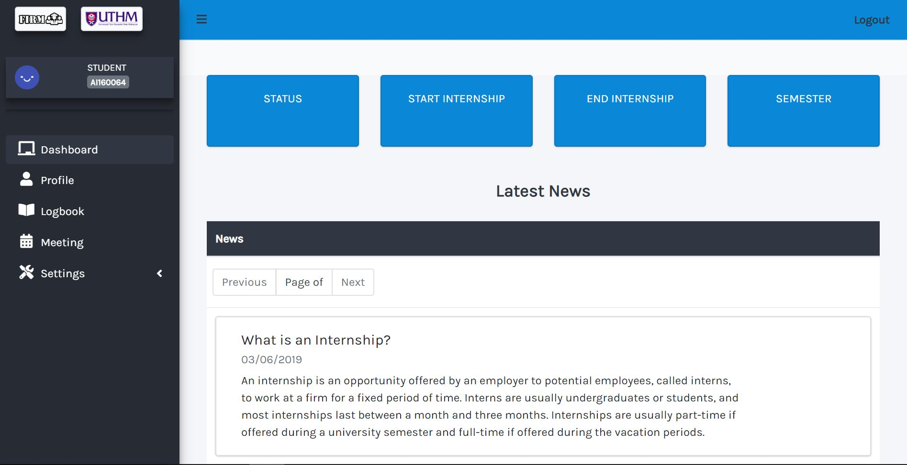
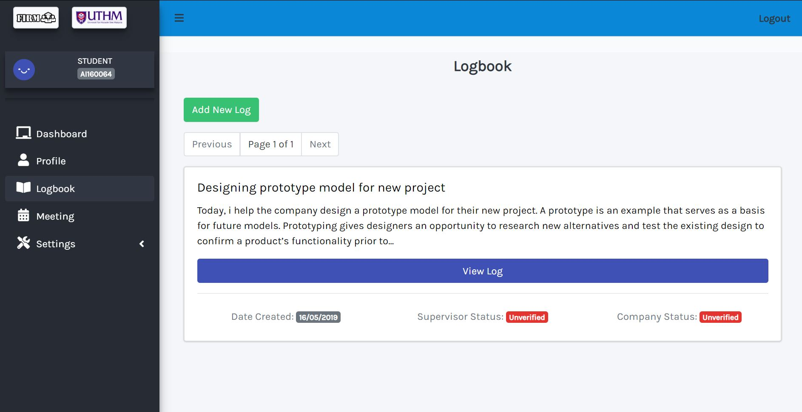

## FIRM
Internship management system built for the students, lectures and admin to manage internship tasks.

## Notes
- The system is used by 4 types of users. Admin(1), Lecture(2), Student(3), Supervisor(4).
- In the internship, a lecture is assign to multiple students. The system allows the admin to sort out the lectures with students to be assign.
- Students can make logs in the system. The log is verified by 2 people; assigned lecture and the company's supervisor.
- Admin can add news which will be viewable by them, the students and the lectures.
- Lecture's assign will set a meeting date for them to meet, which will be confirm by their students.
- As the data used is collected from an online source, no user registration is done. Generate dummy data to test the system.
- Login as : 
Admin -> id:admin,password:admin 
Student -> id:ai160064,password:1234 
Lecture -> id:lct123, password:1234 
Supervisor -> id:sv123,password 1234

## Modules
- Login
- Dashboard
- Profile page
- Manage logbooks
- Manage news
- Manage meetings
- Sort internship

## Language
- Frontend : Vue.JS
- Backend : Laravel

## Screenshots

    &nbsp  &nbsp  &nbsp  &nbsp

